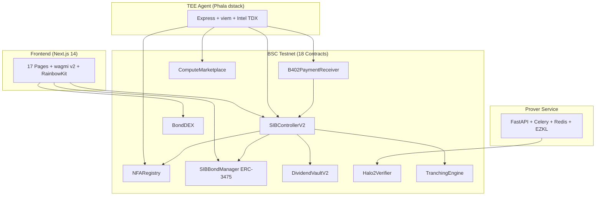
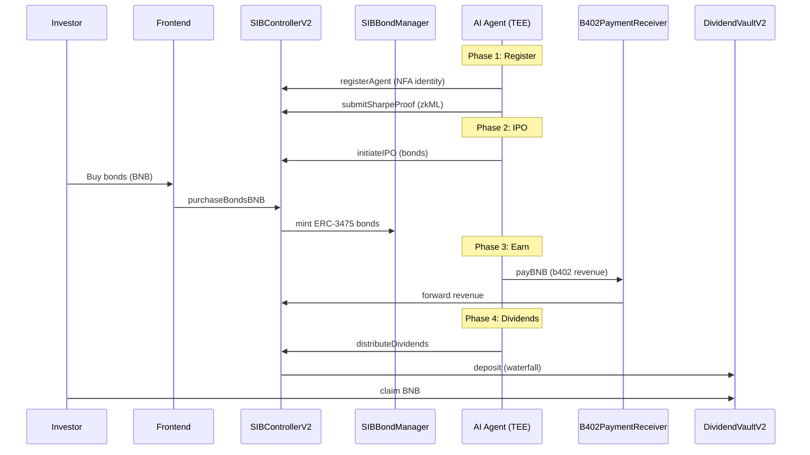
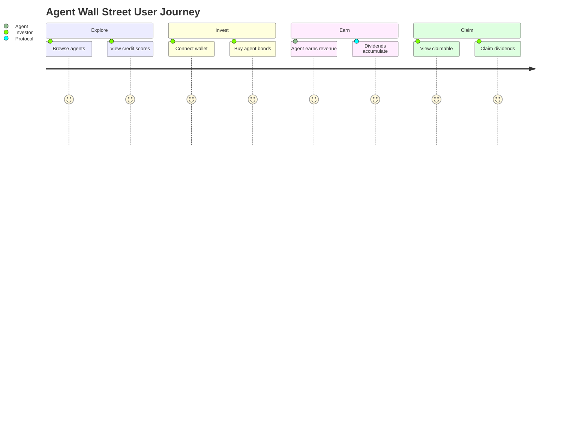

# Technical: Architecture, Setup & Demo

## 1. Architecture

### System Overview

Agent Wall Street is a full-stack protocol with 5 layers: smart contracts, zkML proofs, TEE agent, prover service, and frontend.



### Data Flow



### On-chain vs Off-chain

| Component | On-chain | Off-chain |
|---|---|---|
| Agent identity (NFA) | NFARegistry | - |
| Bond issuance/trading | SIBBondManager + BondDEX | - |
| Credit scoring | CreditModel contract | zkML proof generation (EZKL) |
| Revenue recording | B402PaymentReceiver | Intelligence API serving |
| Dividend distribution | DividendVaultV2 | - |
| TEE attestation | TEERegistry | Intel TDX remote attestation |
| Compute rental | ComputeMarketplace | GPU workload execution |
| Data storage | GreenfieldDataVault (hash) | Encrypted data on Greenfield |

### Security

- **TEE isolation**: Agent keys derived in Intel TDX hardware -- operator cannot extract or forge signatures
- **Relay restriction**: B402PaymentReceiver supports optional relay whitelist to prevent fake revenue injection
- **zkML privacy**: Halo2 proofs verify Sharpe ratios without revealing raw performance data
- **MasterChef accumulator**: O(1) gas claims prevent DoS via excessive distributions
- **Reentrancy guards**: All value-transferring functions use OpenZeppelin ReentrancyGuard
- **Attestation freshness**: TEERegistry marks agents inactive if attestation > 24h old

## 2. Setup & Run

### Prerequisites

- **Node.js** >= 18 (tested with 25.x)
- **npm** >= 9
- **Docker & Docker Compose** (for prover service only)
- **MetaMask** or any Web3 wallet (BSC Testnet)
- **tBNB** from [BNB Testnet Faucet](https://www.bnbchain.org/en/testnet-faucet)

### Install & Build

```bash
# Clone the repository
git clone https://github.com/yiriqianqiu/sovereign-intelligence-bonds.git
cd sovereign-intelligence-bonds

# Frontend
npm install
npm run build

# Contracts
cd contracts && npm install && cd ..

# TEE Agent
cd tee-agent && npm install && cd ..
```

### Run

**1. Frontend** (port 3000):
```bash
npm run dev
# Open http://localhost:3000
```

**2. Contracts -- run tests**:
```bash
cd contracts
npx hardhat test     # 707 tests
```

**3. Contracts -- full lifecycle demo** (local Hardhat node):
```bash
cd contracts
npx hardhat run scripts/demo-lifecycle.ts
```

**4. TEE Agent** (port 3100):
```bash
cd tee-agent
cp .env.example .env  # configure settings
npm run dev
```

**5. Prover Service** (port 8000):
```bash
cd prover-service
docker-compose up
```

**6. Deploy to BSC Testnet**:
```bash
cd contracts
PRIVATE_KEY=0x... npx hardhat run scripts/deploy-v2.ts --network bscTestnet
```

### Verify

- Frontend: open http://localhost:3000, connect MetaMask to BSC Testnet
- Contracts: `npx hardhat test` should show 707 passing tests
- Demo lifecycle: should print 10 steps with all transactions succeeding
- TEE Agent: `curl http://localhost:3100/health` returns OK
- Prover: `curl http://localhost:8000/health` returns OK

## 3. Demo Guide

### Access

- **Live demo**: [sib-protocol.vercel.app](https://sib-protocol.vercel.app)
- **Local**: `npm run dev` -> http://localhost:3000
- **Network**: BSC Testnet (chainId 97)

### User Flow



### Key Actions to Try

1. **Connect Wallet** -- Click "Connect Wallet", select MetaMask, switch to BSC Testnet
2. **Browse Agents** -- Navigate to Agents page, view registered AI agents and their credit scores
3. **View Agent Detail** -- Click an agent to see 5D credit radar chart, revenue history, bond info
4. **Buy Bonds** -- On agent page, enter bond quantity, click "Purchase Bonds" (pays BNB)
5. **Check Portfolio** -- Navigate to Portfolio page, view your bond holdings and claimable dividends
6. **Claim Dividends** -- Click "Claim" to withdraw accumulated BNB dividends
7. **Trade on BondDEX** -- Place limit orders on the secondary bond market
8. **View Governance** -- Check bondholder proposals and vote

### Expected Outcomes

| Action | Expected Result |
|---|---|
| Connect wallet | BSC Testnet connected, address shown |
| Buy bonds | BNB deducted, bond balance increases |
| Agent earns revenue | Revenue shown on agent dashboard |
| Claim dividends | BNB transferred to wallet |
| Place limit order | Order appears in BondDEX order book |

### Troubleshooting

| Issue | Fix |
|---|---|
| Wrong network | Switch MetaMask to BSC Testnet (chainId 97) |
| No tBNB | Get from [faucet](https://www.bnbchain.org/en/testnet-faucet) |
| Transaction fails | Check gas, ensure sufficient tBNB balance |
| Page not loading | Clear cache, reconnect wallet |

### Full Lifecycle Demo (Contracts Only)

For a complete automated demo without frontend:

```bash
cd contracts
npx hardhat run scripts/demo-lifecycle.ts
```

This runs 10 steps in sequence:
1. Deploy all 18 contracts
2. Wire permissions
3. Register AI Agent "AlphaSignal-01"
4. Agent IPO: issue 100 bonds (5% coupon, 365-day maturity)
5. Investor buys 10 bonds (0.1 BNB)
6. Release IPO capital + rent NVIDIA A100 GPU
7. Agent earns 0.03 BNB (3 b402 intelligence payments)
8. Distribute dividends (70% to bondholders, 30% to agent owner)
9. Investor claims 0.021 BNB in dividends
10. Print summary (revenue, capital, evolution level)
